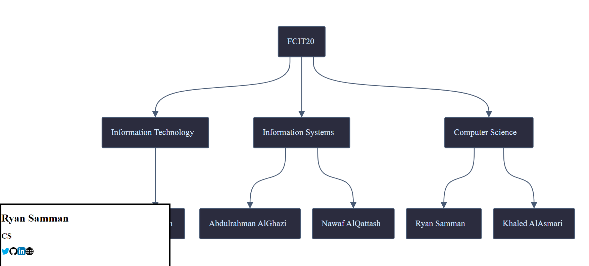

# Student Tree

A Quick prototype I created to try making a React project entirely with Typescript. You can view the website [here](https://m.ryansamman.com/)

A student from FCIT18 made a pull request adding himself to the tree, which can be found [here](https://student-tree-git-fork-mjedal-fcit18-support.ryansamman.vercel.app/). To my suprise, Vercel automatically deployed the pull request to the URL above.